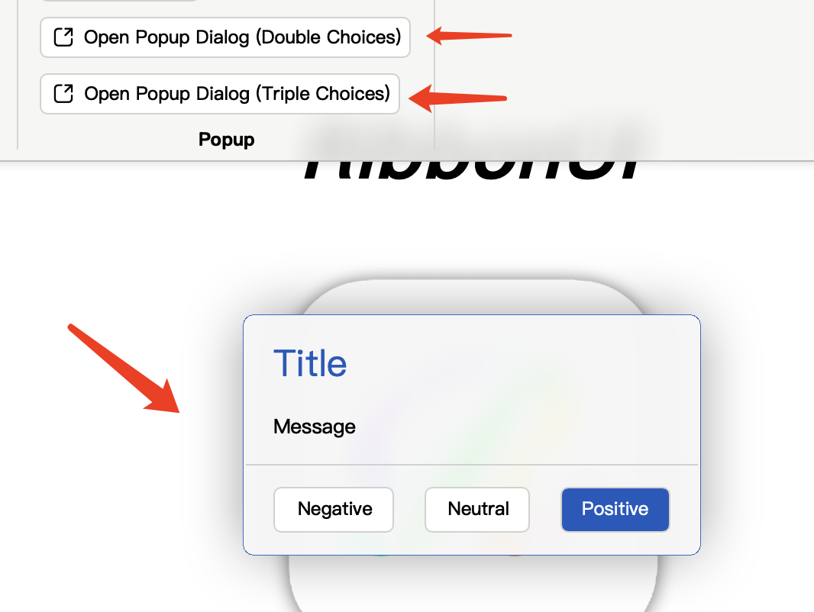

# RibbonUI

<div align="center">
    
</div>

<h1 align="center">Qt RibbonUI </h1>

- [RibbonUI](#ribbonui)
  - [1. 介绍](#1-介绍)
  - [2. 组件列表](#2-组件列表)
  - [3. 支持平台](#3-支持平台)
    - [Qt 6 分支 (main 分支)](#qt-6-分支-main-分支)
    - [Qt 5 分支 (***TODO***)](#qt-5-分支-todo)
  - [4. 如何使用?](#4-如何使用)
  - [5. 鸣谢](#5-鸣谢)
  - [6. 与我联系](#6-与我联系)

## 1. 介绍
RibbonUI是一个参考微软Ribbon风格（即Office 2016后的风格）设计的轻量级、简约且优雅的Qt组件库，用QML写就。

***[Click to view English README](README.md)***

<div align="center">
    <div align="center">
        
        
    </div>
    <p align="center">主界面浅色/深色主题 (经典风格) </p>
</div>
<div align="center">
    <div align="center">
        
        
    </div>
    <p align="center">主界面浅色/深色主题 (现代风格) </p>
</div>

## 2. 组件列表
目前支持***30***种组件，后续会添加更多。
| 名称 | 介绍 | 展示图片|
|:----:|:----:|:----:|
| RibbonWindow | 基于framelesshelper实现的无边框窗口，支持退出确认弹窗及模糊/亚克力化背景。||
| RibbonTabBar | 支持多分组页面切换、自定义右上角工具栏、自由收放的工具栏，如同Word的。|  |
| RibbonTitleBar | 支持自定义背景色、自由添加工具按钮的窗口标题栏，针对Windows和macOS有不同的窗口按钮设计。|  |
| RibbonBottomBar | 支持添加自定义工具的底栏。 | |
| RibbonBlur | 为各种组件提供模糊化效果 |  |
| RibbonButton | 支持有/无背景的纯文字/纯图标/图标加文字的按钮，支持鼠标覆盖显示提示信息 |  |
| RibbonPushButton | 支持弹出菜单的大图标按钮，可以使用内置图标库或用户自选图片 |  |
| RibbonSlider | 支持水平或垂直放置的滑动控制条 |  |
| RibbonIcon | 图标组件，内置图标数百个来自微软的精美图标 |  |
| RibbonText | 文字组件，可以允许/禁止选中文字或复制 |  |
| RibbonCheckBox | 选择框组件，可自定义是否显示文字、文字显示位置（左/右） |  |
| RibbonSwitchButton | 开关按钮，支持自定义背景颜色、是否显示提示文字或按钮文字，可自由调整文字显示位置（左/右） |  |
| RibbonTheme | 主题支持浅色、深色、跟随系统三种模式 |  |
| RibbonMenu | 菜单组件，支持二元选择及子菜单 |  |
| RibbonPopup | 自动居中的弹出式窗口 |  |
| RibbonPopDialog | 支持二元或三元选择的弹出式窗口 |  |
| RibbonLineEdit | 支持设置图标和一键清除的单行文本输入控件 |  |
| RibbonTextEdit | 支持设置图标和一键清除的多行文本输入控件，可随文本输入自动换行/滚动 |  |
| RibbonTextEdit | 支持设置图标和一键清除的多行文本输入控件，可随文本输入自动换行/滚动 |  |
| RibbonComboBox | 支持设置图标的下拉菜单选择控件，菜单支持用户输入添加 |  |
| RibbonSpinBox | 支持设置图标的旋钮控件 |  |
| RibbonSpinBox | 支持设置图标的旋钮控件 |  |
| RibbonView | 与TabBar和BottomBar搭配使用的可滑动组件，两组件模糊化的背景均来源于它 |  |
| RibbonPaperView | 类似Word中纸张的组件 |  |

其他组件的介绍会陆续更新。

## 3. 支持平台
目前是基于Qt 6 设计的，之后有时间会加入Qt 5的支持, ***因此目前仅支持Qt 6支持的平台***。
### Qt 6 分支 (main 分支)
+ Windows: Windows 10 (1809+), Windows 11.(X86/AMD64, aarch64)
+ macOS: macOS 11+.(AMD64, aarch64)
+ Linux: Ubuntu 22.04+ (X86/AMD64)
### Qt 5 分支 (***TODO***)
+ Windows: Windows 7+.(X86/AMD64)
+ macOS: MacOS X 10.13 - 10.15, macOS 11+.(AMD64, aarch64)
+ Linux: Ubuntu 18.04+ (X86/AMD64)

## 4. 如何使用?
+ 安装前准备
  
  安装Qt 6，推荐通过官方在线安装器安装**Qt 6.6.3版本**，**通过brew等方式安装可能会出现问题**。**Qt Quick相关模块**和**qt5compat qtshadertools qtimageformats**组件是必要的。

+ 编译例程和库
  - 下载仓库并进入
    ```shell
    git clone https://github.com/mentalfl0w/RibbonUI.git --recursive
    cd RibbonUI
    ```
  - 创建并进入build文件夹
    ```shell
    mkdir build
    cd build
    ```
  - 编译
    ```shell
    # 如果想进行Debug编译, 请配置 -DCMAKE_BUILD_TYPE=Debug和--config Debug参数
    # 如果想编译静态库, 请在cmake参数中加入-DRIBBONUI_BUILD_STATIC_LIB=ON
    cmake -DCMAKE_MESSAGE_LOG_LEVEL=STATUS -DCMAKE_PREFIX_PATH=/Users/runner/work/RibbonUI/Qt/6.6.3/macos -DCMAKE_C_COMPILER=clang -DCMAKE_CXX_COMPILER=clang++ -DCMAKE_BUILD_TYPE=Release -GNinja ..
    # -DCMAKE_PREFIX_PATH={你的Qt安装目录}
    cmake --build . --target all --config Release --parallel
    ```
+ 在其他项目中使用RibbonUI
  - 遵循***编译例程和库***的下载仓库和进入build目录步骤
  - 在CMakeLists.txt中加入以下语句
    ```camke
    add_subdirectory(RibbonUI) # RibbonUI在你文件系统中的相对路径
    ```
  - 编译
    ```shell
    # 如果想进行Debug编译, 请配置 -DCMAKE_BUILD_TYPE=Debug和--config Debug参数
    # 如果想编译静态库, 请在cmake参数中加入-DRIBBONUI_BUILD_STATIC_LIB=ON
    cmake -DCMAKE_MESSAGE_LOG_LEVEL=STATUS -DCMAKE_PREFIX_PATH=/Users/runner/work/RibbonUI/Qt/6.6.3/macos -DCMAKE_C_COMPILER=clang -DCMAKE_CXX_COMPILER=clang++ -DCMAKE_BUILD_TYPE=Release -DRIBBONUI_BUILD_EXAMPLES=OFF -GNinja ..
    # -DCMAKE_PREFIX_PATH={你的Qt安装目录}
    cmake --build . --target all --config Release --parallel
    ```

## 5. 鸣谢
+ 感谢[@wangwenx190](https://github.com/wangwenx190)的[framelesshelper](https://github.com/wangwenx190/framelesshelper)让RibbonWindow能实现无边框。
+ [@Microsoft](https://github.com/microsoft)的[fluentui-system-icons](https://github.com/microsoft/fluentui-system-icons)提供的漂亮图标库.
+ 感谢[@zhuzichu520](https://github.com/zhuzichu520)的[FluentUI](https://github.com/zhuzichu520/FluentUI) 为我提供的灵感和参考。

## 6. 与我联系
+ Email: mentalflow@ourdocs.cn
+ Blog: [菜鸟技术猿的折腾史.](https://blog.ourdocs.cn)
+ ***欢迎发起PR或Issues，我会在空余时间尽快完善功能或修复bug，希望能一起让RibbonUI变得更好，尽情享受吧🎉！***
