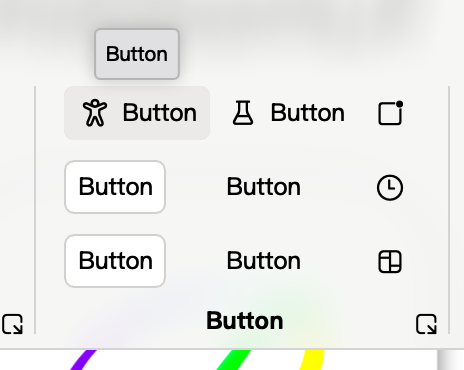
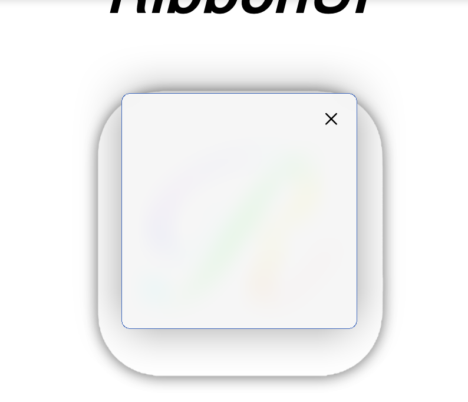
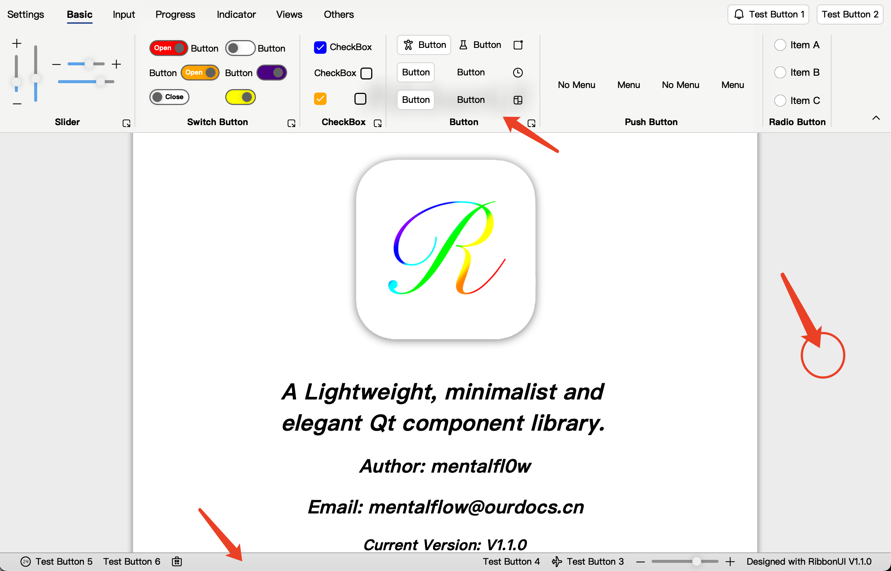

# RibbonUI

<div align="center">
    
</div>
<h1 align="center">Qt RibbonUI </h1>

- [RibbonUI](#ribbonui)
  - [1. Introduction](#1-introduction)
  - [2. Included Components](#2-included-components)
  - [3. Supported platforms](#3-supported-platforms)
    - [Qt 6 branch (main branch)](#qt-6-branch-main-branch)
    - [Qt 5 branch (***TODO***)](#qt-5-branch-todo)
  - [4. How to use it?](#4-how-to-use-it)
  - [5. Acknowledgement](#5-acknowledgement)
  - [6. Get in touch with me](#6-get-in-touch-with-me)


## 1. Introduction
RibbonUI is a lightweight, minimalist and elegant Qt component library written in QML and designed with reference to the Microsoft Ribbon style. 

***[点击查看中文文档](README(zh-cn).md)***

<div align="center">
    <div align="center">
        
        
    </div>
    <p align="center">Home Light/Dark Theme (Classic Style) </p>
</div>
<div align="center">
    <div align="center">
        
        
    </div>
    <p align="center">Home Light/Dark Theme (Modern Style) </p>
</div>

## 2. Included Components
Currently supports ***30*** components, more will be added later.
| Components | Introduction | Demo Picture|
|:----:|:----:|:----:|
| RibbonWindow | A Window component that relies on framelesshelper to support exit confirmation popups and blur style backgrounds. ||
| RibbonTabBar | A toolbar with support for page switching and retracting, and support for placing customized buttons in the upper right corner, just like Microsoft Word's. |  |
| RibbonTitleBar | A window title bar that supports custom colors and the free addition of secondary buttons, with different designs for Windows and macOS. |  |
| RibbonBottomBar | A bottom bar that supports adding custom tools. | |
| RibbonBlur | Provides blurring effects for various components |  |
| RibbonButton | A button that supports plain text/plain icons/icons and text with/without backgrounds, with mouse overlay support for displaying alert messages |  |
| RibbonPushButton | A large icon button that supports pop-up menus, either using the built-in icon library or a user-selected image |  |
| RibbonSlider | Support for horizontally or vertically placed slider |  |
| RibbonIcon | Icon component, built-in hundreds of beautiful icons from Microsoft |  |
| RibbonText | Text component that allows/disallows selection of text or copying |  |
| RibbonCheckBox | Checkbox component, customizable whether to display text, where to display text (left/right) |  |
| RibbonSwitchButton | Switch button, support for customizing the background color, whether to display the prompt text or button text, free to adjust the text display position (left/right) |  |
| RibbonTheme | Theme support light color, dark color, follow system three modes |  |
| RibbonMenu | Menu component with binary selection and submenu support |  |
| RibbonPopup | Auto-centered pop-ups |  |
| RibbonPopDialog | Popups supporting binary or ternary selection |  |
| RibbonLineEdit | Single-line text input control with support for icons and one-click clearing |  |
| RibbonTextEdit | Multi-line text input control with support for icons and one-click clearing, automatic line feed/scrolling as text is entered |  |
| RibbonComboBox | Supports drop-down menu selection controls with icons, and menus can be added with user input. |  |
| RibbonSpinBox | SpinBox with support for setting icons |  |
| RibbonView | Slidable component for use with TabBar and BottomBar, from which the blurred backgrounds of both components are derived. |  |
| RibbonPaperView | Components similar to paper in Word |  |

***The introduction of other components will be updated later.***

## 3. Supported platforms
The current design is based on Qt 6, and support for Qt 5 will be added sometime later, ***so the current support list is consistent with Qt 6***.
### Qt 6 branch (main branch)
+ Windows: Windows 10 (1809+), Windows 11.(X86/AMD64, aarch64)
+ macOS: macOS 11+.(AMD64, aarch64)
+ Linux: Ubuntu 22.04+ (X86/AMD64)
### Qt 5 branch (***TODO***)
+ Windows: Windows 7+.(X86/AMD64)
+ macOS: MacOS X 10.13 - 10.15, macOS 11+.(AMD64, aarch64)
+ Linux: Ubuntu 18.04+ (X86/AMD64)

## 4. How to use it?
+ Before Install
  
  To install Qt 6, it is recommended to install the **Qt 6.6.3** version via the official online installer, **installing via brew, etc. may cause problems**. **Qt Quick related modules** and the **qt5compat qtshadertools qtimageformats** component are required

+ Compile the example and library
  - Clone and enter the library folder
    ```shell
    git clone https://github.com/mentalfl0w/RibbonUI.git --recursive
    cd RibbonUI
    ```
  - Create and enter the build folder
    ```shell
    mkdir build
    cd build
    ```
  - Build
    ```shell
    # if you want to make a Debug build, just let -DCMAKE_BUILD_TYPE=Debug, --config Debug
    # if you want a static build, add -DRIBBONUI_BUILD_STATIC_LIB=ON into command
    cmake -DCMAKE_MESSAGE_LOG_LEVEL=STATUS -DCMAKE_PREFIX_PATH=/Users/runner/work/RibbonUI/Qt/6.6.3/macos -DCMAKE_C_COMPILER=clang -DCMAKE_CXX_COMPILER=clang++ -DCMAKE_BUILD_TYPE=Release -GNinja ..
    # -DCMAKE_PREFIX_PATH={YOUR QT INSTALL FOLDER}
    cmake --build . --target all --config Release --parallel
    ```
+ Use library with other project
  - Follow the same steps like clone and enter build folder as ***Compile the example and library***
  - Add the following code to your CMakeLists.txt
    ```camke
    add_subdirectory(RibbonUI) # RibbonUI's path in your project file system
    ```
  - Build
    ```shell
    # if you want to make a Debug build, just let -DCMAKE_BUILD_TYPE=Debug, --config Debug
    # if you want a static build, add -DRIBBONUI_BUILD_STATIC_LIB=ON into command
    cmake -DCMAKE_MESSAGE_LOG_LEVEL=STATUS -DCMAKE_PREFIX_PATH=/Users/runner/work/RibbonUI/Qt/6.6.3/macos -DCMAKE_C_COMPILER=clang -DCMAKE_CXX_COMPILER=clang++ -DCMAKE_BUILD_TYPE=Release -DRIBBONUI_BUILD_EXAMPLES=OFF -GNinja ..
    # -DCMAKE_PREFIX_PATH={YOUR QT INSTALL FOLDER}
    cmake --build . --target all --config Release --parallel
    ```

## 5. Acknowledgement
+ [@wangwenx190](https://github.com/wangwenx190)'s [framelesshelper](https://github.com/wangwenx190/framelesshelper) for frameless window (aka RibbonWindow's base).
+ [@Microsoft](https://github.com/microsoft)'s [fluentui-system-icons](https://github.com/microsoft/fluentui-system-icons) for beautifully designed icons.
+ [@zhuzichu520](https://github.com/zhuzichu520)'s [FluentUI](https://github.com/zhuzichu520/FluentUI) for inspiration and reference.

## 6. Get in touch with me
+ Email: mentalflow@ourdocs.cn
+ Blog: [The Tossed History of a Rookie Technician.](https://blog.ourdocs.cn)
+ ***And PRs and Issues are welcome, I'll try to improve features or fix bugs as soon as I can in my spare time, let's make RibbonUI better together, enjoy!***
