# 🔘Button Components
- [🔘Button Components](#button-components)
  - [1.RibbonButton](#1ribbonbutton)
    - [1.1 Overview](#11-overview)
    - [1.2 Properties](#12-properties)
    - [1.3 Example Code](#13-example-code)
      - [1.3.1 Basic Button](#131-basic-button)
        - [1.3.1.1 Code](#1311-code)
        - [1.3.1.2 Code Preview](#1312-code-preview)
      - [1.3.2 Basic Button With Icon](#132-basic-button-with-icon)
        - [1.3.2.1 Code](#1321-code)
        - [1.3.2.2 Code Preview](#1322-code-preview)
      - [1.3.3 Icon Button](#133-icon-button)
        - [1.3.3.1 Code](#1331-code)
        - [1.3.3.2 Code Preview](#1332-code-preview)
  - [2.RibbonSwitchButton](#2ribbonswitchbutton)
    - [2.1 Overview](#21-overview)
    - [2.2 Properties](#22-properties)
    - [2.3 Example Code](#23-example-code)
      - [2.3.1 Switch with Grabber Indicator Text](#231-switch-with-grabber-indicator-text)
        - [2.3.1.1 Code](#2311-code)
        - [2.3.1.2 Code Preview](#2312-code-preview)
      - [2.3.2 Switch without Grabber Indicator Text](#232-switch-without-grabber-indicator-text)
        - [2.3.2.1 Code](#2321-code)
        - [2.3.2.2 Code Preview](#2322-code-preview)

## 1.RibbonButton
### 1.1 Overview
+ Parent：Button
+ Demonstrate:
<div align="center">
    <div align="center">
        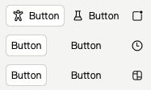
        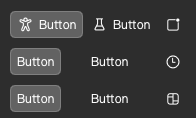
    </div>
    <p align="center">RibbonButton Light/Dark Style</p>
</div>

### 1.2 Properties
<!-- | `` | ``， |  |-->
| Name | Description | Demo picture |
|:----:|:----:|:----:|
| `isDarkMode` | `bool`, night mode, default is controlled by `RibbonTheme` property of the same name | \ |
| `showBg` | `bool`, show button background, default is `True` | 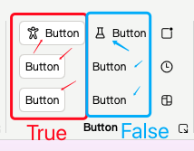 |
| `showHoveredBg` | `bool`, show mouse overlay background, default is `True` | 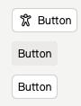 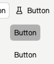 |
| `adaptHeight` | `bool`, adapt the height of the button to the height of the parent container, default is `False` | 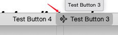 |
| `showTooltip` | `bool`, show `Tooltip` floating window, default is `True` | 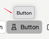 |
| `iconSource` | `var`, button icon, support input image link (`qrc://` or `file://`) or use embedded Microsoft icons (`RibbonIcons`)  | 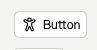 |
| `iconSourceFilled` | `var`，since the code for the hollow and solid versions of Microsoft icons are not fully matched, if the solid icon is abnormal when using inline Microsoft icons and only using iconSource, please replace `RibbonIcons` with `RibbonIcons_Filled` , just like `RibbonIcons.Home -> RibbonIcons_Filled.Home`, and assign the value to this attribute | \ |
| `imageIcon` | `alias`,  for direct access to button's image icon object | \ |
| `ribbonIcon` | `alias`，for direct access to button's embeded icon object | \ |
| `bgColor` | `string`，defines the background color of the button, by default it will switch with the light/dark theme | \ |
| `hoverColor` | `string`，defines the color when the mouse over the button, default will switch with light/dark theme and whether to show the button background or not | \ |
| `pressedColor` | `string`，define the color of the button pressed, default will switch with light/dark theme and whether to show button background or not | \ |
| `checkedColor` | `string`，define the color of the button when it is checked, default is same as `pressedColor` | \ |
| `textColor` | `string`，define the color of the button text, default is black for light theme and white for dark theme | \ |
| `textColorReverse` | `bool`，text color rendering, default is `True`, when the button has no background, if the button is covered/pressed/selected by the mouse, the text color of the button will be lightened to render it as a highlight (only noticeable when dark color is used, this attribute has the possibility to be cancelled) | \ |

### 1.3 Example Code
#### 1.3.1 Basic Button
##### 1.3.1.1 Code
```qml
RibbonButton{
    text:"Button"
}

RibbonButton{
    text:"Button"
    showTooltip: false // don't show the button tip floater
}
```
##### 1.3.1.2 Code Preview
<div align="center">
    <div align="center">
        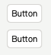
    </div>
    <p align="center">Basic button</p>
</div>

#### 1.3.2 Basic Button With Icon
##### 1.3.2.1 Code
```qml
RibbonButton{
    text:"Button"
    iconSource: RibbonIcons.Accessibility
}

RibbonButton{
    text:"Button"
    showBg:false // don't show background
    iconSource: RibbonIcons.Beaker
    checkable: true // let it could be checked
}
```
##### 1.3.2.2 Code Preview
<div align="center">
    <div align="center">
        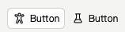
    </div>
    <p align="center">Basic button with icon</p>
</div>

#### 1.3.3 Icon Button
##### 1.3.3.1 Code
```qml
RibbonButton{
    showBg:false // don't show background
    iconSource: RibbonIcons.Badge
    iconSourceFilled: RibbonIcons_Filled.Badge // define solid icon
    checkable: true // let it could be checked
    tipText: "Button" // define the button tip floater's text
}
RibbonButton{
    showBg:false
    iconSource: RibbonIcons.Clock
    iconSourceFilled: RibbonIcons_Filled.Clock
    tipText: "Button"
}
RibbonButton{
    showBg:false
    iconSource: RibbonIcons.Board
    iconSourceFilled: RibbonIcons_Filled.Board
    checkable: true
    tipText: "Button"
    showTooltip: false // don't show the button tip floater
}
```
##### 1.3.3.2 Code Preview
<div align="center">
    <div align="center">
        
    </div>
    <p align="center">Icon button</p>
</div>

## 2.RibbonSwitchButton
### 2.1 Overview
+ Parent class: Button
+ Demonstrate:
<div align="center">
    <div align="center">
        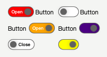
        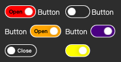
    </div>
    <p align="center">RibbonSwitchButton Light/Dark Style</p>
</div>

### 2.2 Properties
<!-- | `` | ``， |  |-->
| Name | Description | Example Image |
|:----:|:----:|:----:|
| `isDarkMode` | `bool`, Night mode, controlled by the same-named property of `RibbonTheme` by default | \ |
| `showGrabberText` | `bool`, Display the text of the grabber indicator, default text is `Open`/`Close` | 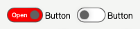 |
| `grabberText` | `string`, Default is `Open` when the switch is checked, otherwise `Close` | \ |
| `textColor` | `string`, The color of the switch's label text, default is `white` in night mode, otherwise `black` | 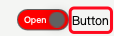 |
| `textSize` | `int`, The size of the switch's label text | \ |
| `grabberCheckedColor` | `string`, The background color of the grabber indicator when the switch is checked, default is `#8AAAEB` in night mode, otherwise `#2850A4` | 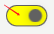 |
| `grabberUncheckedColor` | `string`, The background color of the grabber indicator when the switch is not checked, default is `#292929` in night mode, otherwise `white` | 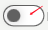 |
| `grabberTextCheckedColor` | `string`, The text color of the grabber indicator when the switch is checked, default is `black` in night mode, otherwise `white` | 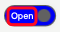 |
| `grabberTextUncheckedColor` | `string`, The text color of the grabber indicator when the switch is not checked, default is `white` in night mode, otherwise `black` | 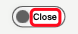 |
| `grabberColor` | `string`, The color of the grabber indicator | 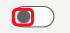 |
| `borderColor` | `string`, The border color of the switch, default is `white` in night mode, otherwise `#616161` | 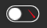 |
| `borderWidth` | `real`, The width of the switch's border, default is `1.4` |  |
| `textBold` | `bool`, Display the switch label text in bold, default is `false` | \ |
| `textOnLeft` | `bool`, Display the switch label text on the left side of the switch, default is `false` | 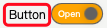 |
| `showTooltip` | `bool`, Display button tooltip, default is `False` | \ |
| `tipText` | `string`, Button tooltip text | \ |

### 2.3 Example Code
#### 2.3.1 Switch with Grabber Indicator Text
##### 2.3.1.1 Code
```qml
RibbonSwitchButton{
    text: "Button"
    showGrabberText: true // Display the text of the grabber indicator
    textOnLeft: false // Let the switch label display on the left side of the switch
    grabberCheckedColor: "indigo" // The color of the grabber indicator
}
```

##### 2.3.1.2 Code Preview
<div align="center">
    <div align="center">
        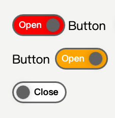
    </div>
    <p align="center">RibbonSwitchButton With Grabber Text</p>
</div>

#### 2.3.2 Switch without Grabber Indicator Text
##### 2.3.2.1 Code
```qml
RibbonSwitchButton{
    text: "Button"
    showGrabberText: false // Do not display the text of the grabber indicator
    textOnLeft: false // Let the switch label display on the left side of the switch
    grabberCheckedColor: "indigo" // The color of the grabber indicator
}
```

##### 2.3.2.2 Code Preview
<div align="center">
    <div align="center">
        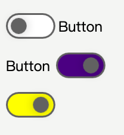
    </div>
    <p align="center">RibbonSwitchButton Without Grabber Text</p>
</div>